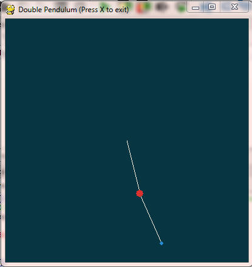
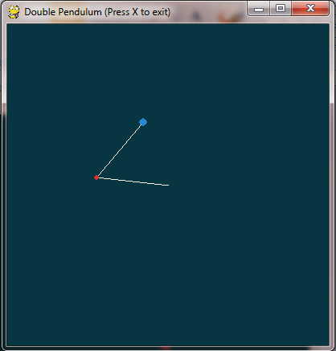
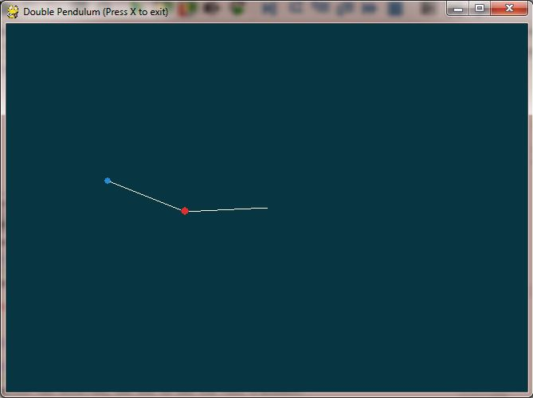

# Chaotic-Double-Pendulum
A pygame simulation of the chaotic double pendulum system using the system's Lagrangian and the RK4 numerical method.

Pressing "r" will reset simulation with randomised intial angles, masses and velocities.
Other variables (gravitational acceleration, rod lengths, etc) can also be changed, but this must be done in the code.

Window is resizeable as you please.

Sample screenshots:

